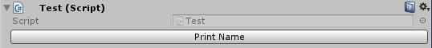
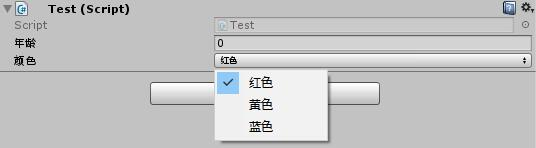

# Unity-Utils

A micro collection of unity3d utils for me and by me.

---
- **BitUtil**

  It's about bit operation

  eg:

  ```c#
  int SetBit(this int A, int k, bool val)
  ```

  ```c#
  int ClearBit(this int A, int k)
  ```

  ```c#
  int ToggleBit(this int A, int k)
  ```

  ```c#
  bool GetBit(this int A, int k)
  ```

  ```c#
  string ToBinaryString(this int A, char sep = ',')
  ```

​    

- **LINQUtil**

  It's extension based on LINQ

  eg:

  ```c#
  string ToOneLineString()
  ```

  ```c#
  T RandomOne<T>()
  ```

  ```c#
  T RandomSome<T>()
  ```

​    

- **EditorButton**

  It can add buttons in Inspector panel in Unity3D with attribute.

  eg:

  ```c#
  public class Test : MonoBehaviour
  {
      [Button]
      public void PrintName()
      {
          Debug.Log(name);
      }
  }
  ```



​    


- **EditorRename**

  It can rename the field which showed in Inspector panel.

  eg:

  ```c#
  public enum EColor
  {
      [Rename("红色")]
      A,
      [Rename("黄色")]
      B,
      [Rename("蓝色")]
      C
  }
  
  public class Test : MonoBehaviour
  {
      [Rename("年龄")]
      public int Age;
  
      [Rename("颜色")]
      [SerializeField]
      private EColor color;
  }
  ```

  

